# AI Agents with Google ADK

```mermaid
flowchart LR
    id["This ❤ Unicode"]
```




This repository contains a collection of experimental agents built on top of the Google Agent Development Kit (ADK). The agents highlight different workflows:

- `personal_assistant` exposes a simple text assistant.

- `coding_workflow` chains multiple sub-agents to write, review, and refactor code.

- `web_agent` augments an agent with Tavily-powered web search.

The examples target Python 3.12 and the Gemini model family.

## Prerequisites

- Google AI Studio API access. Create a key in [Google AI Studio](https://aistudio.google.com/prompts/new_chat).
- Tavily account and API key for web-enabled agents. Sign up at [tavily.com](https://www.tavily.com/).


## Installation

1. Install [uv](https://docs.astral.sh/uv/getting-started/installation/) if it is not already available.

2. Clone this repository and change into the project directory.

3. Resolve dependencies with:

```bash
uv sync
```

4. Credential Setup: Store your credentials (API-keys) in `.env.example` and rename the file to `.env` (make sure to add .env to your .gitignore):

```bash
GOOGLE_API_KEY="<your-google-ai-studio-key>"
TAVILY_API_KEY="<your-tavily-key>"
```

## Running the Agents

Launch the ADK web console in your Terminal (includes all agent-examples):

```bash
uv run adk web
```

This uses the ADK launcher bundled with the project dependencies. 


## Notes

- Treat API keys as secrets. Do not commit them to version control.

- Refer to the [Google ADK docs](https://google.github.io/adk-docs/) for deeper customization and deployment options.
